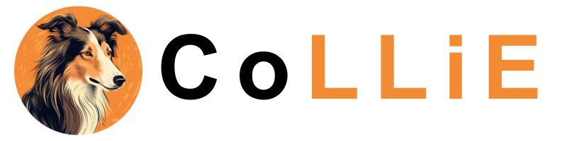
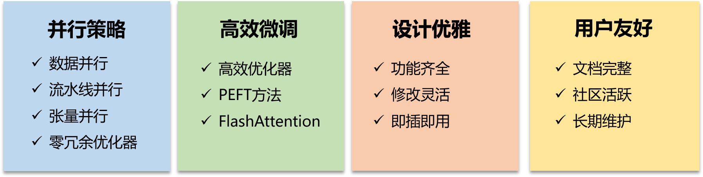
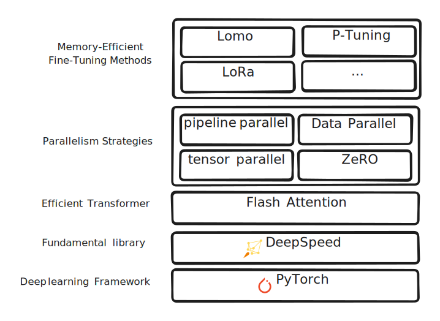
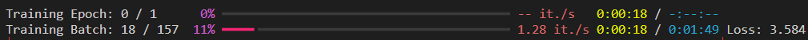
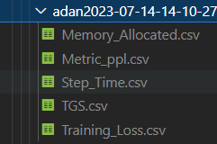
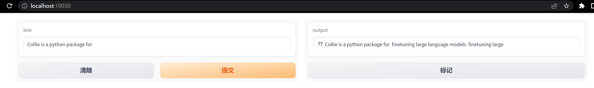

<div align="center">
 
</div>

# CoLLiE

CoLLiE (Collaborative Tuning of Large Language Models in an Efficient Way)，一个帮助您从零开始训练大模型的完整工具箱。


[](https://github.com/openlmlab/collie/stargazers)
[]()
[](https://openlmlab-collie.readthedocs.io/zh_CN/latest/)
[](https://huggingface.co/openlmlab)
[](https://pypi.org/project/collie-lm/)
[](https://github.com/OpenLMLab/collie/commits/main)
[](https://github.com/OpenLMLab/collie/issues)

<h4 align="center">
  <p>
     [ <a href="https://github.com/OpenLMLab/collie/blob/dev/README.md">简体中文</a> ] |
     [ <a href="https://github.com/OpenLMLab/collie/blob/dev/README_EN.md">English</a> ]
  </p>
</h4>


## 新闻
* [2023/07/18] 发布Python包`collie-lm`。您可以在[链接](https://pypi.org/project/collie-lm/#history)中查看更多细节！

## 目录
<ul>
    <li><a href="#为什么选择CoLLiE">为什么选择CoLLiE</a></li>
    <li><a href="#特性">特性</a></li>
    <li><a href="#CoLLiE支持的模型">CoLLiE支持的模型</a></li>
    <li><a href="#评测">评测</a></li>
    <li><a href="#安装">安装</a></li>
    <li><a href="#Docker安装">Docker安装</a></li>
    <li><a href="#使用">使用</a>
        <ul>
            <li><a href="#快速开始">快速开始</a></li>
            <li><a href="#有趣的插件">有趣的插件</a></li>
            <li><a href="#更多成功样例和完整教程">更多成功样例和完整教程</a></li>
        </ul>
    </li>
    <li><a href="#社区">社区</a></li>
    <li><a href="#贡献者">贡献者</a></li>
    <li><a href="#引用我们">引用我们</a></li>
</ul>

## 为什么选择CoLLiE
CoLLiE是一个可以帮助您从零开始训练大模型的完整工具箱，它提供了数据预处理、模型微调、模型保存以及训练过程各项指标监测等功能。CoLLiE集成了现有的并行策略、高效参数微调方法和高效优化器，以加快训练的速度，提高训练的质量，降低训练的开销。CoLLiE支持主流的多种模型（如MOSS, InternLM, LLaMA, ChatGLM等），您可以轻松在不同的模型之间切换。此外，CoLLiE提供了丰富的文档，使初学者可以快速入门。同时，CoLLiE还提供了高度可定制化的功能和灵活的配置选项，使有经验的用户能够根据自己的需求进行个性化定制。无论您是初学者还是有经验的专业人士，CoLLiE都可以为您提供满足需求的解决方案。

## 特点

CoLLiE 基于 *DeepSpeed* 和 *PyTorch*，为大型语言模型提供协作式和高效的调优方法。
它主要包括以下四个特点：

<div align="center">
    
</div>

- 并行策略
  - 数据并行 (DP)
  - [流水线并行 (PP)](https://arxiv.org/pdf/1811.06965.pdf)
  - [张量并行 (TP)](https://arxiv.org/pdf/2104.04473.pdf)
  - [零冗余优化器 (ZeRO)](https://arxiv.org/pdf/1910.02054.pdf)
- 高效微调
  - [LOMO](https://arxiv.org/pdf/2306.09782.pdf)
  - [LoRA](https://arxiv.org/pdf/2106.09685.pdf)
  - [Flash Attention](https://arxiv.org/pdf/2205.14135.pdf)
- 设计优雅
- 用户友好

<details>
  <summary>完整特性</summary>
  <div align="center">
      
  </div>
</details>

## CoLLiE支持的模型
- [MOSS-MOON](https://github.com/OpenLMLab/MOSS)
    - [moss-moon-003-base](https://huggingface.co/fnlp/moss-moon-003-base)
    - [moss-moon-003-sft](https://huggingface.co/fnlp/moss-moon-003-sft)
    - [moss-moon-003-sft-plugin](https://huggingface.co/fnlp/moss-moon-003-sft-plugin)
- [InternLM](https://github.com/InternLM/InternLM)
    - [internlm-7b](https://huggingface.co/internlm/internlm-7b)
    - [internlm-chat-7b](https://huggingface.co/internlm/internlm-chat-7b)
    - [internlm-chat-7b-8k](https://huggingface.co/internlm/internlm-chat-7b-8k)
- [LLaMA](https://github.com/facebookresearch/llama)
    - [llama-7b-hf](https://huggingface.co/decapoda-research/llama-7b-hf)
    - [llama-13b-hf](https://huggingface.co/decapoda-research/llama-13b-hf)
    - [llama-30b-hf](https://huggingface.co/decapoda-research/llama-30b-hf)
    - [llama-65b-hf](https://huggingface.co/decapoda-research/llama-65b-hf)
- [LLaMA-2](https://github.com/facebookresearch/llama)
    - [Llama-2-7b-hf](https://huggingface.co/meta-llama/Llama-2-7b-hf)
    - [Llama-2-13b-hf](https://huggingface.co/meta-llama/Llama-2-13b-hf)
    - [Llama-2-70b-hf](https://huggingface.co/meta-llama/Llama-2-70b-hf)
    - [Llama-2-7b-chat-hf](https://huggingface.co/meta-llama/Llama-2-7b-chat-hf)
    - [Llama-2-13b-chat-hf](https://huggingface.co/meta-llama/Llama-2-13b-chat-hf)
    - [Llama-2-70b-chat-hf](https://huggingface.co/meta-llama/Llama-2-70b-chat-hf)
- [OpenLLaMA](https://github.com/openlm-research/open_llama)
    - [open_llama_3b](https://huggingface.co/openlm-research/open_llama_3b)
    - [open_llama_7b](https://huggingface.co/openlm-research/open_llama_7b)
    - [open_llama_13b](https://huggingface.co/openlm-research/open_llama_13b)
    - [open_llama_7b_v2](https://huggingface.co/openlm-research/open_llama_7b_v2)
- [ChatGLM](https://github.com/THUDM/ChatGLM-6B)
    - [chatglm-6b](https://huggingface.co/THUDM/chatglm-6b)
- [ChatGLM2](https://github.com/THUDM/ChatGLM2-6B)
    - [chatglm2-6b](https://huggingface.co/THUDM/chatglm2-6b)


## 评测

### 吞吐量
|            | 7B   | 13B  | 30B  | 65B  |
| ---------- | ---- | ---- | ---- | ---- |
| Finetune   | 2    | 3    | 6    | 16   |
| LoRA       | 1    | 1    | 1    | 2    |
| LOMO       | 1    | 1    | 1    | 2    |

注：在使用Adam优化器的情况下，各个模型需要的最少的GPU（A100）数量

## 安装
在安装前，你需要确保：
* PyTorch >= 1.13
* CUDA >= 11.6 
* Linux OS
### PyPI安装
你可以简单地通过PyPI安装，命令如下：
```bash
pip install collie-lm
```
### 源码安装
```bash
git clone https://github.com/OpenLMLab/collie
python setup.py install
```

## Docker安装

## 使用

### 快速开始

下面将提供一个使用CoLLiE训练Moss的样例，同时使用LOMO优化器，并且开启ZeRO3来降低显存消耗。

那么，请按照下面的步骤开启你的大模型训练之旅吧~ 


#### 第一步：导入必要的包
```python
from transformers import AutoTokenizer
from collie.config import CollieConfig
from collie.data import CollieDatasetForTraining
from collie.data import CollieDataLoader
from collie.optim.lomo import Lomo
from collie.controller.trainer import Trainer
from collie.controller.evaluator import EvaluatorForPerplexity, EvaluatorForGeneration
from collie.models.moss_moon import Moss003MoonForCausalLM
from collie.utils.monitor import StepTimeMonitor, TGSMonitor, MemoryMonitor, LossMonitor, EvalMonitor
from collie.metrics import DecodeMetric, PPLMetric
from collie.module import GPTLMLoss
from collie.utils.data_provider import GradioProvider
```

#### 第二步：设置路径
选择预训练模型为MOSS
```
pretrained_model = "fnlp/moss-moon-003-sft"
```

#### 第三步：设置CoLLiE配置
```python
config = CollieConfig.from_pretrained(pretrained_model, trust_remote_code=True)
# 张量并行
config.tp_size = 2
# 数据并行
config.dp_size = 1
# 流水线并行
config.pp_size = 1
# 训练的epoch数量
config.train_epochs = 1
# 每{100}个step进行一次eval
config.eval_per_n_steps = 100
# 每{1}个epoch进行一次eval
config.eval_per_n_epochs = 1 
# 每个GPU的batch_size设置为{16}
config.train_micro_batch_size = 16
# 每次eval的batch_size为{1}
config.eval_batch_size = 1
# 设置DeepSpeed配置
config.ds_config = {
        # 开启FP16
        "fp16": {
            "enabled": True
        },
        "zero_allow_untested_optimizer": True,
        "zero_force_ds_cpu_optimizer": False,
        # 开启ZeRO-3
        "zero_optimization": {
            "stage": 3,
            "offload_optimizer": {
                "device": "cpu",
                "pin_memory": False
            }
        },
        "monitor_config": {
            "enabled": True,
            "tag": "adan",
            "csv_monitor": {
                "enabled": True,
                "output_path": "./ds_logs/"
            }
        }
}
```

#### 第四步：设置Tokenizer
```python
tokenizer = AutoTokenizer.from_pretrained("fnlp/moss-moon-003-sft", trust_remote_code=True)
```

#### 第五步：加载数据集
这里自定义一个数据集，数据格式可以提供两种形式，具体请参考文档。
```python
train_dataset = [
    {
        'input': 'Collie is a python package for ',
        'output': 'finetuning large language models.'
    } for _ in range(10000)
]
train_dataset = CollieDatasetForTraining(train_dataset, tokenizer)
eval_dataset = train_dataset[:32]
```

#### 第六步：加载预训练模型
```python
model = Moss003MoonForCausalLM.from_pretrained(pretrained_model, config=config)
```

#### 第七步：设置优化器
```python
optimizer = Lomo(
    model,
    lr = 0.001,
    clip_grad_norm = 5.0
)
```

#### 第八步：添加监视器
```python
monitors = [
    # 每个step用时监测
    StepTimeMonitor(config),
    # TGS（每秒生成token数量监测）
    TGSMonitor(config),
    # 显存使用情况监测
    MemoryMonitor(config),
    # Loss值监测
    LossMonitor(config),
    # Eval结果监测
    EvalMonitor(config)
]
```

#### 第九步：添加Evaluator
这里添加两个Evaluator，分别用于计算PPL(困惑度：Perplexity)和保存Decode结果。
```python
evaluator_ppl = EvaluatorForPerplexity(
    model = model,
    config = config,
    dataset = eval_dataset,
    monitors = [
        EvalMonitor(config)
    ],
    metrics = {
        'ppl': PPLMetric()
    }
)
evaluator_decode = EvaluatorForGeneration(
    model = model,
    config = config,
    tokenizer = tokenizer,
    dataset = eval_dataset,
    monitors = [
        EvalMonitor(config)
    ],
    metrics = {
        'decode': DecodeMetric()
    }

)
```

#### 第十步：实例化Trainer
```python
trainer = Trainer(
    model = model,
    config = config,
    loss_fn = GPTLMLoss(-100),
    optimizer = optimizer,
    train_dataset = train_dataset,
    monitors = monitors,
    evaluators = [evaluator_ppl, evaluator_decode],
)
# 开始训练/验证
trainer.train()
```

#### 最后一步：启动命令行，开始训练！👍
```bash
Command CUDA_VISIBLE_DEVICES=0,1,2,3 torchrun --rdzv_backend=c10d --rdzv_endpoint=localhost:29402 --nnodes=1 --nproc_per_node=4 finetune_moss_for_training.py
```
如果你的命令行出现如下的进度条，那么恭喜你，你已经成功开始训练你的大模型！
<div align="center">
 
</div>

完整代码请参考<a href="https://github.com/OpenLMLab/collie/blob/dev/examples/finetune_moss_for_training.py">examples/finetune_moss_for_training.py</a>。

### 有趣的插件

CoLLiE提供了许多即插即用的插件，下面将介绍Monitor检测器和异步DataProvider，更多插件等待探索和开发...

#### Monitor监测器
在CollieConfig.ds_config中添加monitor配置，并在Trainer中启用即可在训练过程中打开监测器。
```python
    "monitor_config": {
        # 开启检测器
        "enabled": True,
        # 保存的文件名前缀
        "tag": "adan",
        # 保存文件格式:csv
        "csv_monitor": {
            "enabled": True,
            # 保存文件夹
            "output_path": "./ds_logs/"
        }
    }
```
启用检测器后，你将在`ds_logs`文件夹中获取相关的文件，如：
<div align="center">
 
</div>

#### 异步DataProvider
你只需要在Trainer中添加：data_provider，即可在训练过程中打开一个异步DataProvider，方便及时Human Eval！
```python
trainer = Trainer(
    model = model,
    config = config,
    loss_fn = GPTLMLoss(-100),
    optimizer = optimizer,
    train_dataset = train_dataset,
    monitors = monitors,
    evaluators = [evaluator_ppl, evaluator_decode],
    # 添加
    data_provider = GradioProvider(tokenizer)
)
```
<div align="center">
 
</div>


### 更多成功样例和完整教程
CoLLiE提供了完整的 [教程](https://openlmlab-collie.readthedocs.io/zh_CN/latest/)。 更多的示例也可在 [示例](examples) 中查看。

## 社区

## 贡献者
<a href="https://github.com/Openlmlab/collie/graphs/contributors">
  
</a>

## 引用我们
