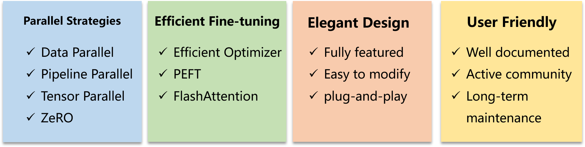

<div align="center">
 
</div>

# CoLLiE

CoLLiE (Collaborative Tuning of Large Language Models in an Efficient Way) is a comprehensive toolbox that helps you train large language models from scratch.


[](https://github.com/openlmlab/collie/stargazers)
[](https://openlmlab-collie.readthedocs.io/zh_CN/latest/)
[](https://huggingface.co/openlmlab)

<h4 align="center">
  <p>
     [ <a href="https://github.com/OpenLMLab/collie/blob/dev/README.md">简体中文</a> ] |
     [ <a href="https://github.com/OpenLMLab/collie/blob/dev/README_EN.md">English</a> ]
  </p>
</h4>

## Latest News
* [2023/12] 🎉 CoLLiE is accepted by EMNLP System Demonstrations: [CoLLiE: Collaborative Training of Large Language Models in an Efficient Way](https://arxiv.org/abs/2312.00407)
* [2023/07] Release python package collie-lm(1.0.2). You can find more detials in this [link](https://pypi.org/project/collie-lm/#history).

## Table of Contents
<ul>
    <li><a href="#Why-CoLLiE">Why CoLLiE</a></li>
    <li><a href="#Features">Features</a></li>
    <li><a href="#CoLLiE-Supported-Models">CoLLiE Supported Models</a></li>
    <li><a href="#Evaluation">Evaluation</a></li>
    <li><a href="#Installation">Installation</a></li>
    <li><a href="#Use Docker">Use Docker</a></li>
    <li><a href="#Usage">Usage</a>
        <ul>
            <li><a href="#Quick-Start">Quick Start</a></li>
            <li><a href="#Fun-Plugins">Fun Plugins</a></li>
            <li><a href="#More-successful-examples-and-complete-tutorials">More successful examples and complete tutorials</a></li>
        </ul>
    </li>
    <li><a href="#Community">Community</a></li>
    <li><a href="#Contributors">Contributors</a></li>
    <li><a href="#Citation">Citation</a></li>
</ul>

## Why CoLLiE
CoLLiE (Collaborative Tuning of Large Language Models in an Efficient Way) is a complete toolkit for training large models from scratch, providing data preprocessing, model fine-tuning, model saving and monitoring of training metrics, etc. CoLLiE integrates exisiting parallel strategies, efficient parameter fine-tuning methods and high-efficiency optimizers to speed up training, improve training quality and reduce training cost. CoLLiE supports a wide range of models (e.g. MOSS, InternLM, LLaMA, ChatGLM, etc.) In addition, CoLLiE provides rich documentation so that beginners can get started quickly. At the same time, CoLLiE offers high customisable features and flexible configuration options, allowing experienced users to personalise it to their needs. Whether you are a begginer or an experienced professional, CoLLiE has a solution for your needs.

## Features
CoLLiE provides collaborative and efficient tuning methods for large language models based on *DeepSpeed* and *PyTorch*. 
It primarily includes the following four features:
<div align="center">
    
</div>

- Parallelism Strategies
  - Data Parallelism
  - [Pipeline Parallelism](https://arxiv.org/pdf/1811.06965.pdf)
  - [Tensor Parallelism](https://github.com/NVIDIA/Megatron-LM)
  - [Zero Redundancy Optimizer (ZeRO)](https://arxiv.org/pdf/1910.02054.pdf)
- Efficient Fine-tuning
  - [LOMO](https://arxiv.org/pdf/2306.09782.pdf)
  - [LoRA](https://arxiv.org/pdf/2106.09685.pdf)
  - [Flash Attention](https://arxiv.org/pdf/2205.14135.pdf)
- Elegant Design
- Friendly Usage

<details>
  <summary>Full Features</summary>
  <div align="center">
      
  </div>
</details>

## CoLLiE Supported Models

- [MOSS-MOON](https://github.com/OpenLMLab/MOSS)
    - [moss-moon-003-base](https://huggingface.co/fnlp/moss-moon-003-base)
    - [moss-moon-003-sft](https://huggingface.co/fnlp/moss-moon-003-sft)
    - [moss-moon-003-sft-plugin](https://huggingface.co/fnlp/moss-moon-003-sft-plugin)
- [InternLM](https://github.com/InternLM/InternLM)
    - [internlm-7b](https://huggingface.co/internlm/internlm-7b)
    - [internlm-chat-7b](https://huggingface.co/internlm/internlm-chat-7b)
    - [internlm-chat-7b-8k](https://huggingface.co/internlm/internlm-chat-7b-8k)
- [LLaMA](https://github.com/facebookresearch/llama)
    - [llama-7b-hf](https://huggingface.co/decapoda-research/llama-7b-hf)
    - [llama-13b-hf](https://huggingface.co/decapoda-research/llama-13b-hf)
    - [llama-30b-hf](https://huggingface.co/decapoda-research/llama-30b-hf)
    - [llama-65b-hf](https://huggingface.co/decapoda-research/llama-65b-hf)
- [OpenLLaMA](https://github.com/openlm-research/open_llama)
    - [open_llama_3b](https://huggingface.co/openlm-research/open_llama_3b)
    - [open_llama_7b](https://huggingface.co/openlm-research/open_llama_7b)
    - [open_llama_13b](https://huggingface.co/openlm-research/open_llama_13b)
    - [open_llama_7b_v2](https://huggingface.co/openlm-research/open_llama_7b_v2)
- [ChatGLM](https://github.com/THUDM/ChatGLM-6B)
    - [chatglm-6b](https://huggingface.co/THUDM/chatglm-6b)
- [ChatGLM2](https://github.com/THUDM/ChatGLM2-6B)
    - [chatglm2-6b](https://huggingface.co/THUDM/chatglm2-6b)

## Evaluation

### ThroughPut
|            | 7B   | 13B  | 30B  | 65B  |
| ---------- | ---- | ---- | ---- | ---- |
| Finetune   | 2    | 3    | 6    | 16   |
| LoRA       | 1    | 1    | 1    | 2    |
| LOMO       | 1    | 1    | 1    | 2    |

Note: Minimum number of GPUs (A100) required for each model with Adam's optimiser
## Installation
```bash
pip install git+https://github.com/OpenLMLab/collie.git
```

## Use Docker

## Usage

### Quick Start

Here we will provide a sample of training "MOSS" using CoLLiE while using the LOMO optimizer and turning on ZeRO3 to reduce memory consumption.

So, follow the steps below to start your LLM training journey~


#### Step 1: Import the necessary packages
```python
from transformers import AutoTokenizer
from collie.config import CollieConfig
from collie.data import CollieDatasetForTraining
from collie.data import CollieDataLoader
from collie.optim.lomo import Lomo
from collie.controller.trainer import Trainer
from collie.controller.evaluator import EvaluatorForPerplexity, EvaluatorForGeneration
from collie.models.moss_moon import Moss003MoonForCausalLM
from collie.utils.monitor import StepTimeMonitor, TGSMonitor, MemoryMonitor, LossMonitor, EvalMonitor
from collie.metrics import DecodeMetric, PPLMetric
from collie.module import GPTLMLoss
from collie.utils.data_provider import GradioProvider
```

#### Step 2: Set your path (Optional)
Here, we have chosen the pretrained model as MOSS.
```python
pretrained_model = "fnlp/moss-moon-003-sft"
```

#### Step 3: Set the CoLLiE Configuration
```python
config = CollieConfig.from_pretrained(pretrained_model, trust_remote_code=True)
# Note that tp_size * dp_size * pp_size = the number of GPUs
# Tensor Parallel
config.tp_size = 2
# Data Parallel
config.dp_size = 1
# Pipeline Parallel
config.pp_size = 1
# the number of training epochs
config.train_epochs = 1
# eval per {100} steps
config.eval_per_n_steps = 100
# eval per {1} epoch
config.eval_per_n_epochs = 1 
# The batch_size for each GPU is set to {16}
config.train_micro_batch_size = 16
# The batch_size for each eval is {1}
config.eval_batch_size = 1
# DeepSpeed Configuration
config.ds_config = {
        "fp16": {
            "enabled": True
        },
        "zero_allow_untested_optimizer": True,
        "zero_force_ds_cpu_optimizer": False,
        "zero_optimization": {
            "stage": 3,
            "offload_optimizer": {
                "device": "cpu",
                "pin_memory": False
            }
        },
        "monitor_config": {
            "enabled": True,
            "tag": "adan",
            "csv_monitor": {
                "enabled": True,
                "output_path": "./ds_logs/"
            }
        }
}
```

#### Step 4: Set Tokenizer
```python
tokenizer = AutoTokenizer.from_pretrained("fnlp/moss-moon-003-sft", trust_remote_code=True)
```

#### Step 5: Load datasets
Here we customise a dataset, the data can be provided in two formats. You can refer to tutorials for more details.
```python
train_dataset = [
    {
        'input': 'Collie is a python package for ',
        'output': 'finetuning large language models.'
    } for _ in range(10000)
]
train_dataset = CollieDatasetForTraining(train_dataset, tokenizer)
eval_dataset = train_dataset[:32]
```
#### Step 6: Load Pretrained Model
```python
model = Moss003MoonForCausalLM.from_pretrained(pretrained_model, config=config)
```

#### Step 7: Set Optimizer
```python
optimizer = Lomo(
    model,
    lr = 0.001,
    clip_grad_norm = 5.0
)
```

#### Step 8: Set Monitors
```python
monitors = [
    # Time used per step
    StepTimeMonitor(config),
    # Tokens generated per gpu per second
    TGSMonitor(config),
    # Memory used
    MemoryMonitor(config),
    # Loss
    LossMonitor(config),
    # Evaluation Results
    EvalMonitor(config)
]
```
#### Step 9: Add Evaluators
Two evaluators are added here to calculate PPL (Perplexity) and to save Decode results.
```python
evaluator_ppl = EvaluatorForPerplexity(
    model = model,
    config = config,
    dataset = eval_dataset,
    monitors = [
        EvalMonitor(config)
    ],
    metrics = {
        'ppl': PPLMetric()
    }
)
evaluator_decode = EvaluatorForGeneration(
    model = model,
    config = config,
    tokenizer = tokenizer,
    dataset = eval_dataset,
    monitors = [
        EvalMonitor(config)
    ],
    metrics = {
        'decode': DecodeMetric()
    }

)
```

#### Step 10: Instantiate the Trainer
```python
trainer = Trainer(
    model = model,
    config = config,
    loss_fn = GPTLMLoss(-100),
    optimizer = optimizer,
    train_dataset = train_dataset,
    monitors = monitors,
    evaluators = [evaluator_ppl, evaluator_decode],
)
# 开始训练/验证
trainer.train()
```
#### Final step: launch the command line and start training! 👍
```bash
Command CUDA_VISIBLE_DEVICES=0,1,2,3 torchrun --rdzv_backend=c10d --rdzv_endpoint=localhost:29402 --nnodes=1 --nproc_per_node=4 finetune_moss_for_training.py
```
If the following progress bar appears on your command line, then congratulations, you have successfully started training your Large Language model!

### Documentation and Examples
CoLLiE provides [online documentation](https://openlmlab-collie.readthedocs.io/zh_CN/latest/). More examples are available at [examples](examples).

<div align="center">
 
</div>

You can find complete codes at <a href="https://github.com/OpenLMLab/collie/blob/main/examples/finetune_moss_for_training.py">examples/finetune_moss_for_training.py</a>.

### Fun Plugins
CoLLiE provides a number of plug-and-play plugins, the following will introduce the "Monitor" and "Asynchronous DataProvider", more plugins are waiting to be explored and developed...

#### Monitor
You can add monitor configuration to CollieConfig.ds_config and enable it in Trainer to turn on the monitor during training.
```python
    "monitor_config": {
        # Turn on Monitor
        "enabled": True,
        # prefix of saved files
        "tag": "adan",
        # file format: csv
        "csv_monitor": {
            "enabled": True,
            # folders saved
            "output_path": "./ds_logs/"
        }
    }
```
After enabling the detector, you will get the relevant files in `ds_logs` folder, for example:
<div align="center">
 
</div>

#### Asynchronous DataProvider
You just need to add data_provider in Trainer to open an asynchronous DataProvider during the training process, in which you can human eval at any time.
```python
trainer = Trainer(
    model = model,
    config = config,
    loss_fn = GPTLMLoss(-100),
    optimizer = optimizer,
    train_dataset = train_dataset,
    monitors = monitors,
    evaluators = [evaluator_ppl, evaluator_decode],
    # Add
    data_provider = GradioProvider(tokenizer)
)
```
<div align="center">
 
</div>

### More successful examples and complete tutorials
CoLLiE provides complete [Tutorials](https://openlmlab-collie.readthedocs.io/zh_CN/latest/). More Examples can be found in [examples](https://github.com/OpenLMLab/collie/tree/dev/examples).

## Community

## Contributors
<a href="https://github.com/Openlmlab/collie/graphs/contributors">
  
</a>

## Cite Us

